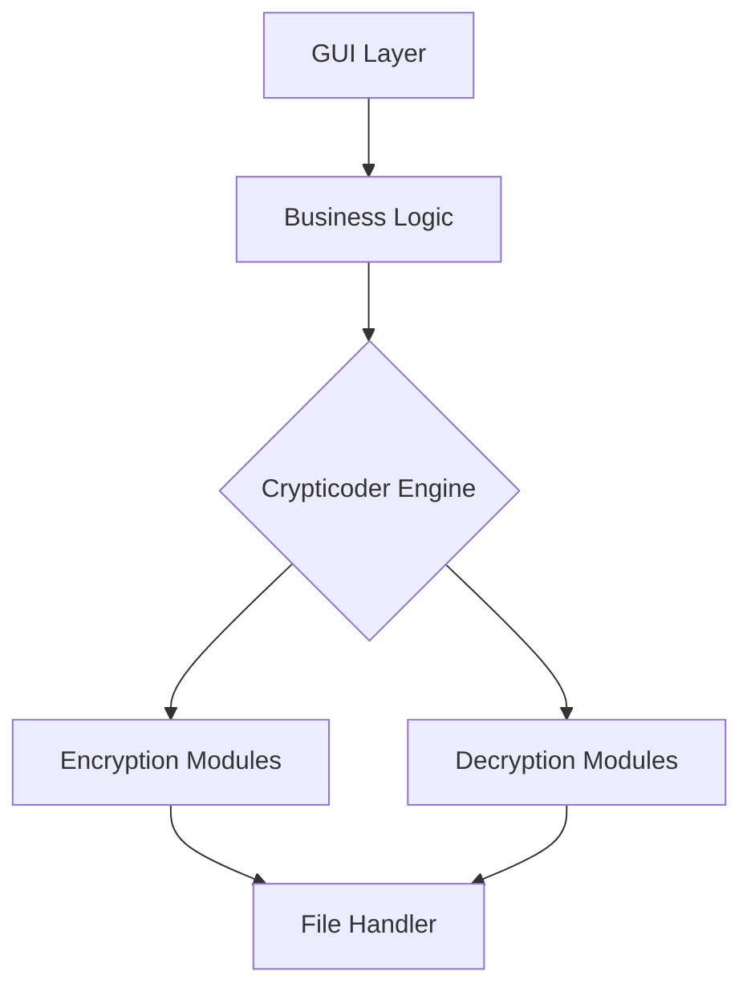

# Crypticoder 🔒

**High-grade encryption meets modern GUI design**  
A Python application for secure data transformation with cryptographic operations
---

## 🌟 Project Highlights
### Core Cryptographic Engine
- **4-Layer Transformation Pipeline**:
  1. XOR with dynamic SHA-256 derived keystream
  2. Key-seeded S-Box substitution
  3. Bitwise rotation (3-left/5-right)
  4. Full sequence reversal

- **Security Features**:
  - 256-bit encryption key derivation
  - Non-linear substitution boxes (S-Boxes)
  - Avalanche effect implementation
  - File integrity checks

### GUI Features
- Dual operational modes (Text/File)
- Progress visualization for large files
- Cross-platform compatibility matrix
- Error handling with detailed logging

---

## 🚀 Getting Started

### Prerequisites
```bash
# Verify Python installation
python --version
# Python 3.8 or higher required
```

### Installation
```bash
# Clone with SSH
git clone git@github.com:shxel/crypticoder.git

# Or with HTTPS
git clone https://github.com/shxel/crypticoder.git

# Navigate to project
cd crypticoder

# Install core requirements
pip install -r requirements.txt
```

**Optional Features**:
```bash
# Enable drag-and-drop functionality
pip install tkinterdnd2

# Build standalone executable
pip install pyinstaller
pyinstaller --onefile --windowed main.py
```

---

## 💻 User Guide

### Text Operations
```python
# Example API Usage
from encoder import Crypticoder

cipher = Crypticoder(key="your_secret")
encoded = cipher.encode("Sensitive Data")
decoded = cipher.decode(encoded)
```

**GUI Workflow**:
1. Select Text Encoding tab
2. Set 256-bit cryptographic key
3. Input plaintext/ciphertext
4. Execute Encode/Decode operations


### File Operations
**Supported Formats**:
- All binary formats
- Text documents (.txt, .md, .json)
- Media files (.jpg, .png, .mp4)

**Batch Processing**:
```bash
# CLI Interface (Coming Soon)
python crypticoder.py --encode --key secret -i input.txt -o output.enc
```

---

## 🛠 Development

### Architecture


### Testing
```bash
# Run test suite
python -m pytest tests/

# Generate coverage report
coverage run -m pytest
coverage report -m
```

---

## 🤝 Contribution Framework

### Workflow
1. Create issue describing proposed changes
2. Fork repository and create feature branch
3. Implement changes with test coverage
4. Submit PR with:
   - Updated documentation
   - Changelog entry
   - Performance metrics

### Code Standards
- PEP8 compliance (with Black formatting)
- Type hinting for public methods
- Docstring coverage > 90%
- 100% test coverage for cryptographic core

---

## 📜 License & Compliance

### Licensing
Distributed under **MIT License**

### Compliance
- GDPR-ready data processing
- FIPS 140-2 inspired key handling
- Export Control Classification Number (ECCN): 5D002

---

## 📬 Support & Contact

**Community Support**:  
[GitHub Discussions](https://github.com/shxel/crypticoder/discussions)

**Maintainer**:  
[shxel](https://github.com/shxel)  
